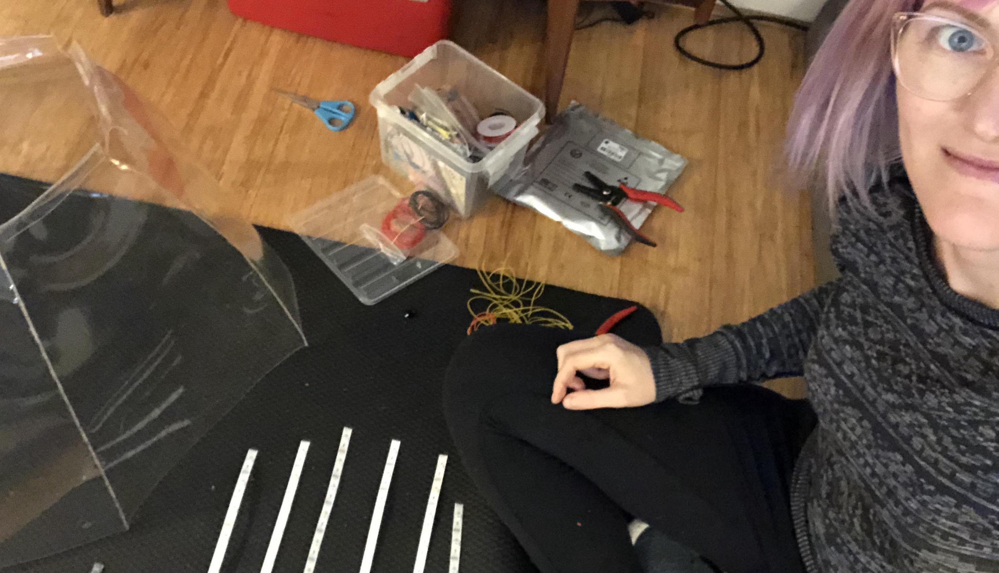
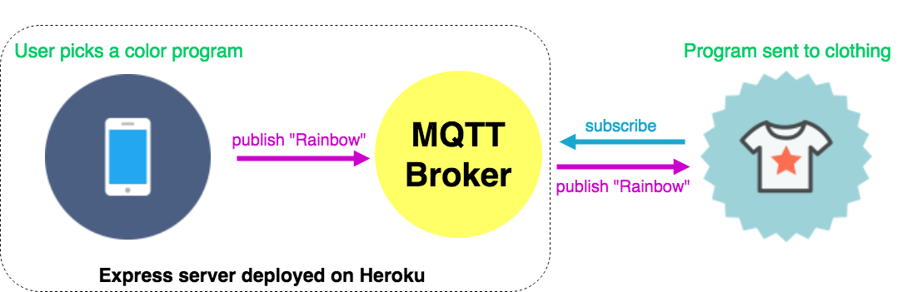

theme: Poster Custom
footer: @stephaniecodes

# Haute Codeture

# <br><br><br><br>

### Stephanie Nemeth

#### @stephaniecodes

[.hide-footer]

---

# Hi, I'm Stephanie.

* Frontend Developer @ [Werkspot](https://werkspot.nl)

* Organizer of [Stupid Hackathon Amsterdam](http://www.stupidhackathon.wtf)<br><br><br>

^I live in Amsterdam.

^Been dev for 3 years, last yr as a frontend/js dev

^Frontend dev @ werkspot

^Organizer of Stupid Hackathon Amsterdam

---

## I like to build fun things with LEDs.


---

## I'm a hardware newbie.

^only been working with hardware for the past year.

^And I didn't get into hardware cuz I had a project in mind to automate some part of my life.

---

### I got inspired at an art museum.

#<br><br><br><br><br><br><br><br><br><br><br><br><br><br><br><br><br><br><br><br><br><br><br><br><br><br><br><br><br><br><br>


^I got into hardware cuz I got inspire by a visit to an art museum.

^Stedelijk museum in Amsterdam

^I went to see an exhibition of art by Jean Tinguely.

---

### Jean Tinguely

#<br><br><br><br><br><br><br><br><br><br><br><br><br><br><br><br><br><br><br><br><br><br><br><br><br><br><br><br><br><br><br><br><br>


^ Jean Tinguely

^ Swiss, 60s/70s

^ Art NOT about standing in a sterile white space, distantly gazing silent painting

^ Art meant to be playful

^ Created installations meant to be triggered by a viewer

^ The viewers's experience was integrated into the overall effect of the work itself

^ It intentionally blurred the line between artist and viewer

^ The viewer is invited to choose a drawing tool (marker, pen, or pencil) and place it in a holder.

^ When put into motion, it moves it along a piece of paper.

^ The result would be a work of art in itself.

^ No longer just watching a process, the viewer, by choosing the drawing tool, plays a role in the creation of an entirely new work of art.

---

> I wanted something ephemeral that would pass like a falling star...The work had to just transpire, make people dream and talk, and that would be all.
> -- Jean Tinguely

^I was inspired by the exhibit

^ this quote by Tinguely stood out to me.

^ Really liked idea of art as a temporary experience that connects an artist and viewer

^ It's spontaneous and,

^ Only meant to bring joy and inspire for short time

^ I was excited by all these ideas

^ and wanted to use my skillset as a developer

^ to make something where a user anywhere in the world could create some kind of art in app

^ and send it back to me as the artist to enjoy for a small amount of time.

---

# My first project


^Person creates a pixel art design on a web app

^Sends it to my raspberry pi

^Shows up on my rpi in my living room

---

# My first project


^Communication between the app and rpi is handled through socketio

^event-based messaging library that works in all browsers/devices

^ i created a socketio server to relay the msgs

^ it was challenging to take on this project and figure out how to get it all to work together.

---

# Creating art with a raspberry pi

🎨 [light-art.herokuapp.com](https://light-art.herokuapp.com)

📹 [goo.gl/mK5afh](https://www.youtube.com/watch?v=eud6LnzVISM)

<br>

^ But I want to tell about my next big hardware project after this one.

^ And send me some pixel art in a few days when I'm back home.

^I gave my first conf talk last year about this project.

^ If interested, Definitely check out the video from Codeland Conf.

^Really inspired by the reaction to my pixel art project

^Started thinking how I can take the experience out of my living room.

---

## What if

## I made my clothing

## the canvas?

^Taking this same idea and transferring it to my clothing

^Really interested in interactions that might occur when people realize it's interactive.

---


^ I wanted to make a complete, cohesive look that was completely interactive via an app.

---

# Project Plan:

* Web app for user input


^ Create a web app for user input

---

# Project Plan:

* Web app for user input
* LEDs + hardware in clothing


^ Integrate LEDs & microcontrollers in diff pcs of clothing

---

# Project Plan

* Web app for user input
* LEDs + hardware in clothing
* Socket.IO: send messages from app to clothing

^ Of course, I'll use SocketIO again

^ Used it in my Raspberry Pi art project

^ Already knew that it works

^ Easy setup: node.js server & client libraries


---

## Easy, right?

^ I had a plan

^ Applying all the things I learned and worked in my first project

^ Everything is gonna go really smoothly

---


# Faced lots of challenges

^ Lots of wiring and soldering

^ Though I had learned a lot from my first project

^ There was new difficulties I faced during this project

---

## Building stuff is all about _*iteration*_

^ I had setbacks that made me unsure of my abilities

^ I felt frustrated and that i was terrible maker and never going to get better at this stuff.

^ but most importantly, I tried to learn from every setback I had

^ And continually improve my project.

---

# Iteration #1

### The starting point

^ So let's start at the beginning

---


^ Since I was going to build a small web app like before, I didn't have to think much about that part of the project

^ Create a simple web app where users choose a color and program for my clothing

^ Create a socketio server to relay the messages from the app to the hardware

^ Deploy both on a simple express server on Heroku.

^ Main focus was on hardware

^ Most of my focus was on figuring out the hardware bit.

---

[.build-lists: true]

# Hardware

* Small footprint
* Durability
* Wifi connectivity

^ Needed to figure out what all I was going to use to control the LEDs in my clothing

^Must be as discrete/small as possible in my clothing

^ Durable - taking off/on

^ Needed wifi to receive messages from the app.

---


# Adafruit Feather Huzzah ESP8266

* Arduino
* Small
* Wifi built-in
* Lots of info/tutorials

^I chose an arduino.

^ Arduino is a great choice for a project like this

^ cuz i just needed it to run the light programs

^ and listen for new messages from the app and change programs.

^ Adafruit Feather Huzzah

^it's small, has built-in wifi

^very popular microchip so lots of info online

---

# Building Phase

---


^ Since I was building 3 separate pieces,

^ It would be the most wiring and soldering i had ever done before

^ Making wiring diagrams BEFORE i attempted anything with the hardware

^ Saved me so much grief - kept me from getting confused in the middle of the build.

---




^So, the build process:

^Basically me sitting on the floor in my living room of my tiny amsterdam apartment, and constructing each piece, testing, and fixing soldering mistakes lol

---

# First Outing: Lighted Bike Ride Amsterdam


^So excited to take it out in public!

^ But as you can see in the video

^ My skirt crashes and reboots to a diff program

^But super FAIL

---

# Fail


^Embarrassed, disappointed

---

# Iteration #2

### (Or, how to make it crash less)

^An opportunity to troubleshoot and make it work better

---

# Figure out where it was crashing

* Use Serial Monitor in Arduino IDE (Log statements)


^Lucky for me, the microcontroller i chose supports monitoring when plugged into my computer

^put in log statements at all diff bits of the code

---

# Figure out where it was crashing

* Use Serial Monitor in Arduino IDE (Log statements)


^very clear was crashing cuz the wifi was disconnecting and reconnecting over and over again

---

## Flaky connection

# <br>

# 🤔

^got me thinking...

---

### Socket.IO is _great_ for the web!

### but is the _best_ fit for my IoT Project?

^Made for web applications communicated over HTTP

^Geared for browsers, but I didn't need that extra overhead

---

### Just because a library is available, doesn't mean it's the best solution

^So i took a step back and thought again about what i was up against coding for hardware.

---

# Coding for Hardware

* Resources are at a premium
* Minimize overhead

^Not communicating between browser and server for my hardware, so that extra overhead for HTTP isn't needed.

^ I needed the most bare minimum (but easy to implement and understand) messaging library possible.

---

## What else can I use?

# <br><br><br><br><br><br><br><br><br><br><br>

---

## What else can I use?

# <br>

## ✨ MQTT ✨

^M2M/IoT connectivity protocol

---

# MQTT

A lightweight messaging protocol<br/>optimized for high-latency or unreliable networks

^Invented in 1999

^Need a solution that allowed for minimal battery loss and minimal bandwidth connecting sensors over satellite connection.

---

# Publish/subscribe


^Publish Subscribe Architecture

^clients and a broker.

^Clients connect to the broker, which then mediates communication between the two devices.

^Each device can subscribe to particular topics.

^When another client publishes a message on a subscribed topic, the broker forwards the message to any client that has subscribed.

^Publisher and subscriber do not need to know each other

^Publisher and subscriber do not need to run at the same time.

^Operations on both components are not halted during publish or receiving

---

# Lightweight

* Transport over TCP/IP
* 2 byte overhead

^MQTT control packet headers are kept as small as possible.

^Having a small header overhead makes this protocol appropriate for IoT by lowering the amount of data transmitted over constrained networks.

^Every bit in the packet is carefully crafted to reduce the data transmitted over the network.

^It means that in comparison with many other protocols (HTTP) it almost does not load the network with the transfer of information, which is necessary only for the functioning of the protocol.

---

# Flexible

* Data agnostic payload

^Send binary, jpgs, etc

---

# Reliable

* Offline Messaging<br/>

^ Hook up a DB

^ Even if the client is offline

^ Messages stored by the broker and are available right after the client reconnects.

---

# Reliable

[^ ]

[^ ]:[http://internetofthingsagenda.techtarget.com/definition/MQTT-MQ-Telemetry-Transport](http://internetofthingsagenda.techtarget.com/definition/MQTT-MQ-Telemetry-Transport)

^Quality of Service

^QoS: agreement between sender and receiver of a message regarding the guarantees of delivering a message

^QoS is a major feature of MQTT, it makes communication in unreliable networks a lot easier because the protocol handles retransmission and guarantees the delivery of the message, regardless how unreliable the underlying transport is

---


^MQTT has short and readable specification.

^ Simple verbs used to describe actions:

^eg CONNECT, PUBLISH, SUBSCRIBE, UNSUBSCRIBE and DISCONNECT types that are significant for developers.

---


^So I was sold!

---

# Setup MQTT Clients + Broker


^ Needed to rework my app, hardware, and server setup and change it to use to use MQTT instead of socketio.

---

# Setup Web App Client


---


^yay can use MQTT in the browser!

^MQTT.js is a client library for the MQTT protocol, written in JavaScript for node.js and the browser.

---

# MQTT.js Client

```javascript
var mqtt = require("mqtt");
// Create a client that connects to the broker
var client = mqtt.connect(MQTT_BROKER_URL);

function sendEvent(program) {
  // Publish topic: "lights", payload: "rainbow"
  client.publish("lights", program);
}

var rainbowButton = document.getElementById("rainbowButton");
rainbowButton.addEventListener("click", () => sendEvent("rainbow"));
```

^Easy to follow

^Only a couple lines of code to implement.

^Include the library

^Create a client that connects to wherever url the mqtt broker is located

^Whenever the rainbowButton is clicked, sends a message to the broker with topic "lights" with the payload being the string "rainbow"

---

# Setup Arduino Clients


---

# Arduino-MQTT Client

```c
#include <MQTTClient.h>

void setup() {
  WiFi.begin(SSID, PW);
  // Connect to broker, subscribe to topic "lights"
  MQTTClient.begin(MQTT_BROKER_URL, WiFiClient);
  MQTTClient.connect("necklace", KEY, TOKEN);
  MQTTClient.subscribe("lights");
  // Called when message received
  MQTTClient.onMessage(messageReceived);
}

void loop() {
  // Sends/receives messages
  MQTTClient.loop();
}
```

^Easy to follow even if you aren't familiar with coding for arduino!

^Only a couple lines of code to implement.

^Include the library

^Connect client to mqtt broker thru the url

^Subscribes to topic "lights"

^Whenever message is received, onMessage method is called.

---

# Setup MQTT Broker


^Everything going really smoothly, setting up the broker should be easy too right?

---

# Setup MQTT Broker



---

# Setup MQTT Broker


---

# MQTT Broker

* Couldn't create my own on Heroku (ports not accessible)
* But... not ready to move services and do devops stuff yet 😮

^ Minor hiccup... but looked for a Broker as a service instead

---

# Setup MQTT Broker


---

# shiftr.io

IoT prototyping platform

* Free
* Easy setup

^Sign up and get a key/token and ready to roll

^Also doesn't seem to be a limitation on # of messages per min

---


^Look it's my setup

^And it worked great!

---


^I was happy but I wasn't ecstatic.

---

### Relying on a small external broker service...

### **not optimal**

^Too many unknowns: great for prototyping but relying on for my whole project, too risky.

^So you can guess what I probably did next...

---

# Iteration #3

### Build my own MQTT broker!

^Built my own mqtt broker

---

# Build a MQTT Broker

* Need access to port 1883
* Heroku → Digital Ocean

^Like I mentioned before, I had deployed my app on heroku but unfortunately could access the ports I needed

^Decided to try my luck at configuring/deploying it on digital ocean since i could access ports i need there.

---

# Build a MQTT Broker


^Embed MQTT Broker in Express server

^Final configuration

---

# MQTT Broker: AEDES


[https://github.com/mcollina/aedes](https://github.com/mcollina/aedes)

^To implement the MQTT broker, used this library

^broker is embeddable in my current express server, minimal configuration change

---

IMPLEMENT THE MQTT BROKER

```javascript
const express = require("express");
const app = express();
const path = require("path");
const aedes = require("aedes")();
// Create MQTT server for MQTT connections
const mqttServer = require("net").createServer(aedes.handle);
// Create HTTP server for website requests
const httpServer = require("http").createServer(app);
const ws = require("websocket-stream");
const mqttPort = 1883;
const appPort = 8080;

mqttServer.listen(mqttPort, function() {});
httpServer.listen(appPort, function() {});

// Augment the HTTP server with MQTT-over-websocket capabilities
ws.createServer({ server: httpServer }, aedes.handle);
```

^Only a couple lines of code to implement.

^Include the library

^Create MQTT server & HTTP server

^Listen on the specified port

^Then addon so the HTTP server has MQTT over websocket capabilities so that it can handle MQTT connections from clients in the browser (our web app)

---


^Awesome!

^I conquered my devops fears and it worked!

^I was done right?

---

# Iteration #4

# <br><br><br><br><br><br>

---

# Iteration #4

#### (aka last thing I changed)

### Upgrade Microcontroller

^Nope, upgrade the hardware

---

[.build-lists: true]


## Adafruit Feather M0 WiFi

* Low power management
* Separate Wifi module
* High speed, reliable Wifi 🤩
* 2X cost of Feather Huzzah

^ Low power management

^ Separate Wifi module

^ So doesn't have to yield to wifi core, steady wifi throughput

^ 2X cost of Feather Huzzah

---

[.build-lists: true]

## What next?

* Feather M0 has full python interpreter onboard

* Rewrite Arduino/C++ code in CircuitPython!<br><br>

---


^Demo time!

---

# Final thoughts

^It can take many iterations to get something right

^I messed a bunch during this with trying to figure out devops

^and sloppy soldering,

^and it was super frustrating,

^but it all helped me learn and improve my skills.

^breaking stereotypes with strangers

---

# Thank you!

🦄✌☮️️✨

[stephanie.lol](https://stephanie.lol)

[@stephanicodes](https://twitter.com/stephaniecodes)
